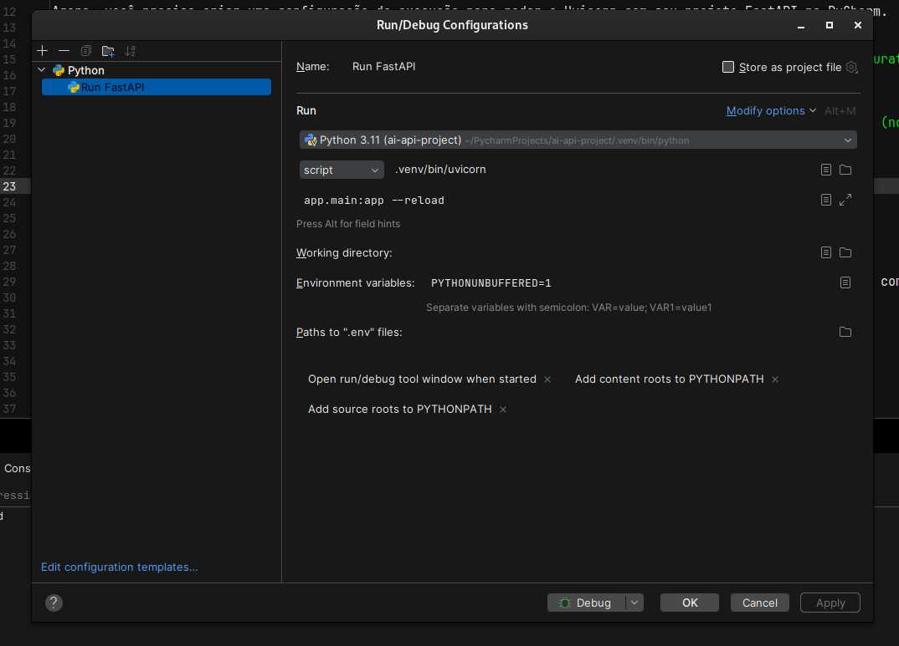

# Run project

Create env virtual

    python3 -m venv venv

    Ative o ambiente virtual:

    source venv/bin/activate

Install requires lib

    pip install -r requirements.txt

Run app

    uvicorn app.main:app --reload

# Docs swagger
    http://127.0.0.1:8000/docs

# Debug mode

Criar uma Configuração de Execução (Run Configuration)

Agora, você precisa criar uma configuração de execução para rodar o Uvicorn com seu projeto FastAPI no PyCharm.

    Abra o PyCharm e navegue até o seu projeto.
    No canto superior direito, clique no menu suspenso onde aparece a opção de execução e escolha Edit Configurations....
    Na janela de configurações, clique no + no canto superior esquerdo para adicionar uma nova configuração.
    Selecione Python.
    No campo Name, insira um nome, por exemplo: Run FastAPI.
    No campo Script Path, você precisará informar o caminho para o Uvicorn. Normalmente, o caminho será assim (no ambiente virtual):

    Linux/MacOS: bash

    .venv/bin/uvicorn

    Windows:

    .\venv\Scripts\uvicorn.exe

No campo Parameters, adicione o caminho para o arquivo principal onde sua aplicação FastAPI está configurada, como app.main:app. Também adicione a opção --reload para habilitar o modo de debug:

app.main:app --reload

No campo Working Directory, selecione a raiz do projeto.
No campo Python Interpreter, escolha o ambiente virtual que você configurou.
Clique em Apply e depois em OK.

# Structure folder
/my_microservice_project
│
├── app/
│   ├── __init__.py
│   ├── main.py                 # Arquivo principal, inicializa o FastAPI e define as rotas
│   ├── api/                    # Módulo para definir os endpoints da API
│   │   ├── __init__.py
│   │   └── routes.py           # Definição das rotas e controladores
│   ├── core/                   # Configurações gerais, middlewares, e dependências
│   │   ├── __init__.py
│   │   └── config.py           # Configurações de ambiente, variáveis de ambiente
│   ├── models/                 # Modelos Pydantic ou SQLAlchemy
│   │   ├── __init__.py
│   │   └── user.py             # Exemplo de modelo para usuários
│   ├── services/               # Lógica de negócio, comunicação com outros microsserviços
│   │   ├── __init__.py
│   │   └── user_service.py     # Exemplo de serviço para usuários
│   ├── db/                     # Conexão e manipulação do banco de dados
│   │   ├── __init__.py
│   │   └── database.py         # Definição da conexão com o banco de dados
│   ├── schemas/                # Schemas de entrada/saída da API (Pydantic)
│   │   ├── __init__.py
│   │   └── user_schema.py      # Schemas relacionados ao modelo de usuários
│   ├── utils/                  # Funções utilitárias e helpers
│   │   ├── __init__.py
│   │   └── security.py         # Exemplo de funções utilitárias para segurança
│   ├── tests/                  # Testes unitários e de integração
│   │   ├── __init__.py
│   │   └── test_main.py        # Exemplo de testes da API
│
├── .env                        # Variáveis de ambiente
├── requirements.txt            # Dependências do projeto (ou Poetry/Pipenv se preferir)
├── Dockerfile                  # Arquivo Docker para contêinerização
├── docker-compose.yml          # Configuração de múltiplos serviços com Docker Compose (se aplicável)
├── alembic/                    # Migrations (se usar SQLAlchemy)
│
└── README.md                   # Documentação do projeto
